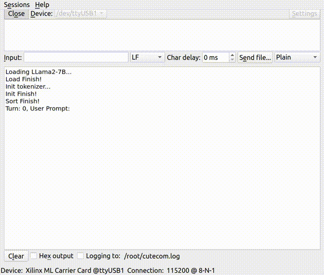
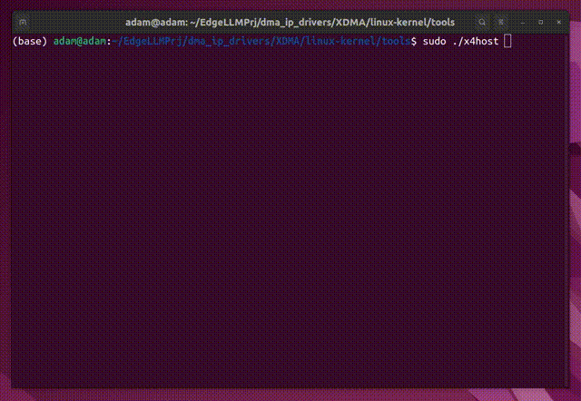

---

#  llama-fpga: FPGA-based LLM Accelerator

**llama-fpga** is *(most probably)* the **world’s first open-source project** for building an **FPGA-based Large Language Model (LLM) accelerator**, capable of running **LLaMA2-7B** in **AWQ 4-bit quantized format**.

This project demonstrates how to deploy modern transformer-based LLMs on embedded and data center FPGAs, offering both **research** and **educational** value in hardware-accelerated AI inference.


##  Hardware Requirements

| Hardware Platform     | Supported?  | Notes                                          |
| --------------------- | ----------- | ---------------------------------------------- |
| **Xilinx KV260**      | ✅  | Uses PS-side 4 GB RAM for model weights        |
| **Xilinx ZCU104**     | ✅  | Two variants: PS/PL weight distribution        |
| **Xilinx Alveo U250** | ✅  | Uses all 4 DDR4 channels for maximum bandwidth |

**Additional Requirements:**

* SD card: **≥ 8 GB**
* For **ZCU104**, a **4 GB DDR4 (Rank = 1)** SODIMM memory module is required.

---

##  Repository Structure

This repository includes **four hardware-specific subprojects**, each corresponding to a distinct FPGA setup:

| Directory       | Platform         | Description                                                      |
| --------------- | ---------------- | ---------------------------------------------------------------- |
| `kv260/`        | KV260            | LLM inference with model weights loaded into PS-side RAM (4 GB). |
| `zcu104_pl/`    | ZCU104 (PL only) | Model weights fully loaded into PL-side 4 GB DDR4 memory.        |
| `zcu104_ps_pl/` | ZCU104 (Hybrid)  | Model weights split between PS and PL memories (each 4 GB).      |
| `alveo_u250/`   | Alveo U250       | Uses all four DDR4 memory channels for maximum performance.      |

---

##  Project Contents

Each subproject contains the following structure:

### **1. Vivado Project**

A complete Vivado design implementing the FPGA system architecture, including DMA engines, AXI interfaces, and accelerator logic.

### **2. XSA File**

The exported `.xsa` hardware definition file, generated after bitstream creation. Used to build Vitis platforms or software applications.

### **3. SDK C Source (for KV260 / ZCU104)**

Contains a C file for Vitis SDK.
To use:

1. Create a **Vitis bare-metal platform**.
2. Create a **“Hello World”** application project.
3. Replace `helloworld.c` with the provided **SDK C file**.
4. Build and deploy to your FPGA board.

### **4. Demo Video**

Each project folder includes a **demo video** demonstrating real-time decoding performance.

---

##  Python Utilities

A **Jupyter Notebook** is provided to:

* Generate binary model files for each hardware configuration.
* Convert **LLaMA2-7B** weights into **AWQ 4-bit quantized** format.

You’ll need to:

1. Download the official **LLaMA2-7B** model.
2. Quantize it using **AWQ**.
3. Run the notebook to produce the corresponding binary files.

---

##  Running on Alveo U250

For the **Alveo U250** configuration:

* The project uses **XDMA in DMA mode**.
* Install Xilinx’s DMA driver:
  [Xilinx dma_ip_drivers](https://github.com/Xilinx/dma_ip_drivers)

### Steps:

1. Copy `load_param.sh` and `host_sdk.c` to
   `XDMA/linux-kernel/tools/`
2. Compile the host software:

   ```bash
   gcc host_sdk.c -o host_sdk
   ```
3. Run `load_param.sh` to load model parameters.
4. Execute the binary to start decoding.

>  The procedure is similar to running a standard XDMA DMA test demo.

---

##  Verilog Implementation

All **Verilog HDL sources** are located in each project’s `.src` directory.
These files are **auto-generated by SpinalHDL**, so while they may not be human-optimized, their hierarchy is clean and easy to follow for debugging and study.

---

##  Model-Adaptation Notice

This FPGA accelerator is **tightly coupled to the internal structure of the LLaMA2-7B model**.
Numerous design decisions — such as tensor partitioning, memory access scheduling, and operator fusion — are **highly customized** to match the architectural layout and computation pattern of LLaMA2-7B in its **AWQ 4-bit quantized** form. As a result, **porting this design to other model architectures** is **non-trivial** and may require substantial modifications.

##  Performance

### **Decoding Speed**

| Platform         | Speed (tokens/s) |
| ---------------- | ---------------- |
| KV260            | ~5               |
| ZCU104 (PL-only) | ~4               |
| ZCU104 (PS + PL) | ~8–9             |
| Alveo U250       | ~18–19           |

### Demo on KV260



### Demo on ZCU104


### Demo on Alveo U250



### **Prefill Phase**

Currently, only the **decode phase** is hardware-accelerated.
Due to limited FPGA resources, **prefill** runs **token-by-token**.

However, an upcoming version of this project aims to:

* Accelerate the prefill phase by **2× – 4×**
* Run efficiently on **smaller and cheaper FPGAs**

>  Stay tuned for updates — the next release will bring higher efficiency and broader hardware support!

---

##  Hardware Architecture

Detailed architectural design and implementation details can be found in the following academic publications.
If you use this project in your research or product, **please cite** these works:

```bibtex
@inproceedings{li2025pushing,
  title={Pushing up to the limit of memory bandwidth and capacity utilization for efficient llm decoding on embedded fpga},
  author={Li, Jindong and Li, Tenglong and Shen, Guobin and Zhao, Dongcheng and Zhang, Qian and Zeng, Yi},
  booktitle={2025 Design, Automation & Test in Europe Conference (DATE)},
  pages={1--7},
  year={2025},
  organization={IEEE}
}
```
```bibtex
@article{li2025hummingbird,
  title={Hummingbird: A Smaller and Faster Large Language Model Accelerator on Embedded FPGA},
  author={Li, Jindong and Li, Tenglong and Chen, Ruiqi and Shen, Guobin and Zhao, Dongcheng and Zhang, Qian and Zeng, Yi},
  booktitle={2025 International Conference on Computer-Aided Design (ICCAD)},
  year={2025},
  organization={IEEE}
}
```
